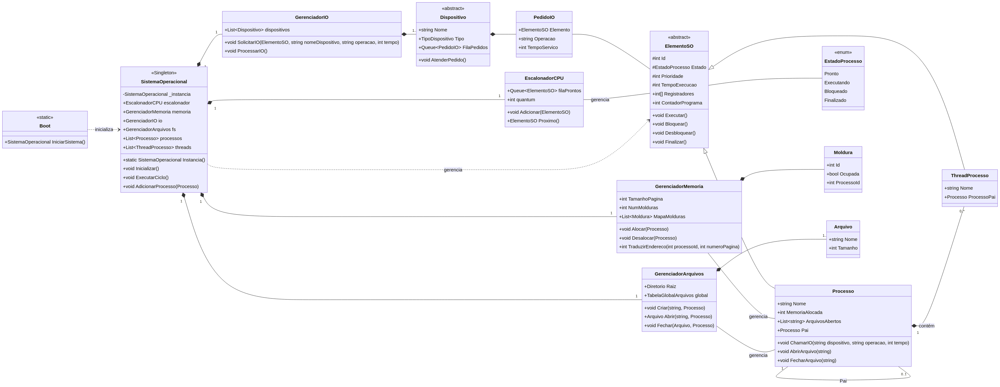

# Simulação de Sistema Operacional em C#

Este projeto é uma **simulação em console de um Sistema Operacional (SO)** básico, desenvolvido em C# (.NET 8.0). O objetivo principal é demonstrar e visualizar os conceitos fundamentais de um SO, como gerenciamento de processos, escalonamento de threads, gerenciamento de memória e operações de I/O e sistema de arquivos.

## Funcionalidades Principais

A simulação abrange os seguintes módulos e conceitos de Sistemas Operacionais:

| Módulo | Descrição | Implementação |
| :--- | :--- | :--- |
| **Gerenciamento de Processos e Threads** | Criação, alocação e execução de processos e suas threads. | `Modelos/Processo.cs`, `Modelos/Thread.cs` |
| **Escalonamento de Processos** | Implementação do algoritmo **Round Robin** para gerenciar a execução das threads. | `Escalonadores/RoundRobinEscalonador.cs` |
| **Gerenciamento de Memória** | Simulação de alocação e desalocação de memória para processos. | `Maquina/GerenciadorMemoria.cs` |
| **Gerenciamento de I/O** | Simulação de dispositivos de I/O e suas operações. | `Maquina/GerenciadorIO.cs`, `Maquina/Dispositivo.cs` |
| **Sistema de Arquivos** | Estrutura básica para gerenciamento de arquivos. | `Maquina/GerenciadorArquivos.cs`, `Maquina/Arquivo.cs` |
| **Estatísticas** | Geração de um relatório final com métricas de desempenho da simulação. | `Maquina/EstatisticasSO.cs` |

## Estrutura do Projeto

O projeto está organizado em módulos que refletem as principais responsabilidades de um Sistema Operacional:

*   **`Maquina/`**: Contém a lógica central do SO, incluindo a classe principal `SistemaOperacional.cs`, o inicializador `Boot.cs` e os gerenciadores de recursos (`GerenciadorMemoria.cs`, `GerenciadorIO.cs`, `GerenciadorArquivos.cs`).
*   **`Modelos/`**: Classes de dados para os elementos do SO, como `Processo.cs`, `Thread.cs` e `ModeloProcesso.cs`.
*   **`Escalonadores/`**: Implementações dos algoritmos de escalonamento, como o `RoundRobinEscalonador.cs`.
*   **`Interfaces/`**: Definições de contratos para a criação de processos e escalonadores.
*   **`Program.cs`**: Ponto de entrada da aplicação, responsável por iniciar o SO, simular a execução por ciclos e exibir o estado final e as estatísticas.

## Instalação e Execução

Para rodar a simulação, você precisará do SDK do .NET 8 instalado em sua máquina.

### Pré-requisitos

*   [.NET 8 SDK](https://dotnet.microsoft.com/download/dotnet/8.0)

### Passos para Execução

1.  **Clone o repositório:**
    ```bash
    git clone https://github.com/dellarosa11/SistemasOperacionais.git
    cd SistemasOperacionais
    ```

2.  **Execute o projeto:**
    ```bash
    dotnet run
    ```

O programa irá inicializar o sistema operacional, criar processos e threads, simular a execução por 20 ciclos utilizando o escalonador Round Robin e, por fim, exibir o estado final dos processos e um relatório de métricas.

## Diagrama de Classes

O diagrama abaixo ilustra a arquitetura e as relações entre as principais classes do projeto:


## Contribuidores

Este projeto foi desenvolvido por:

*   **Matheus Della Rosa** - 113209
*   **Iago Mickael dos Santos** - 113569
